# Toy Store UI Prototype

A modern, responsive user interface prototype for a digital toy store application. This project demonstrates frontend development skills using Angular and Bootstrap.

**[View Live Demo](https://tomovicj.github.io/toy-store-ui-prototype)**


## Overview

This is a complete UI prototype for a toy store e-commerce application. It features a clean, intuitive interface that allows users to browse, search, filter, and interact with toy products. The prototype includes multiple pages such as a product catalog, product details, user authentication, profile management, reviews, and order history. All data is stored locally for demonstration purposes.


## Tech Stack

- **Framework:** Angular 20
- **Styling:** Bootstrap 5.3 + Bootstrap Icons
- **Language:** TypeScript 5.9
- **Package Manager:** Bun
- **Build Tool:** Angular CLI


## Key Design Decisions

1. **Offline-First:** The prototype is completely offline with all data stored in local storage, making it easy to demonstrate without backend dependencies.

2. **Component-Based Architecture:** The UI is built with reusable components for maintainability and consistency.

3. **Responsive Design:** Bootstrap's grid system ensures the application works seamlessly across devices.

4. **Type Safety:** Full TypeScript implementation with proper interfaces for all data models.

5. **Modern Angular Features:** Uses Angular's latest features including standalone components and signals.


## Features

### Browse & Discover
- View a catalog of toys with rich product information
- Filter toys by category and brand
- Sort toys by price, rating, and name
- Responsive grid layout that adapts to all screen sizes

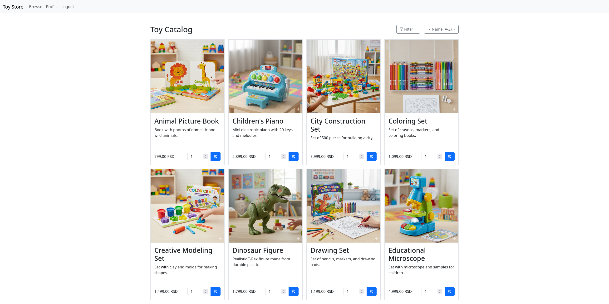

### Product Details
- Detailed product pages with images and specifications
- View customer reviews and ratings
- Reserve toys for purchase

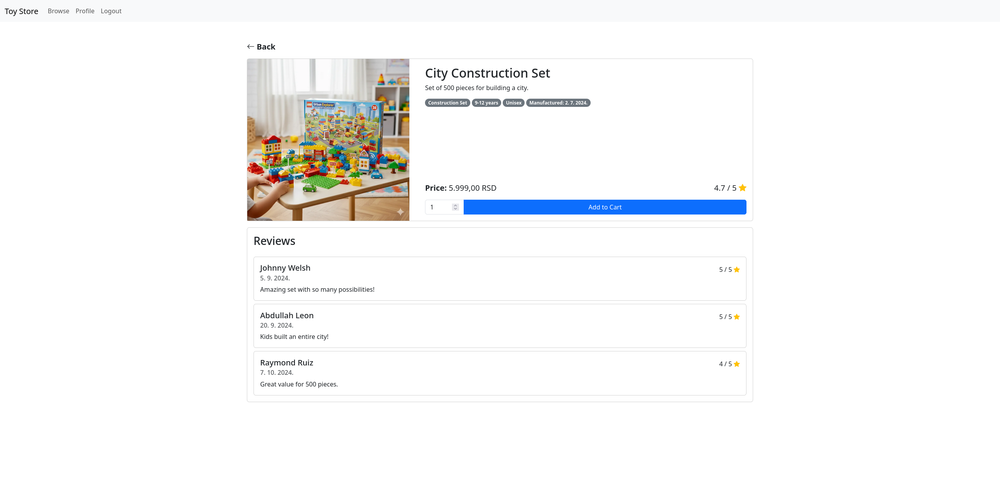

### User Authentication
- User registration and login system
- Protected routes for authenticated users
- Role-based access control (customer/guest)

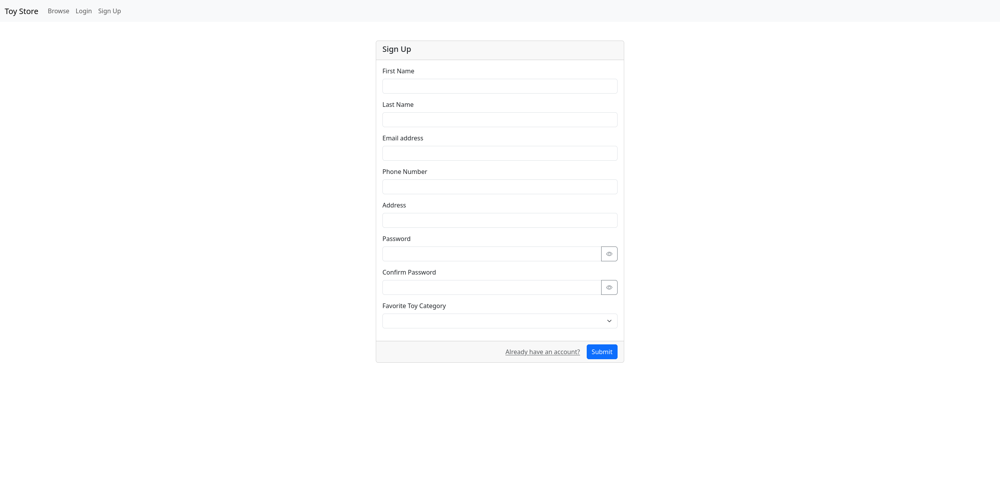

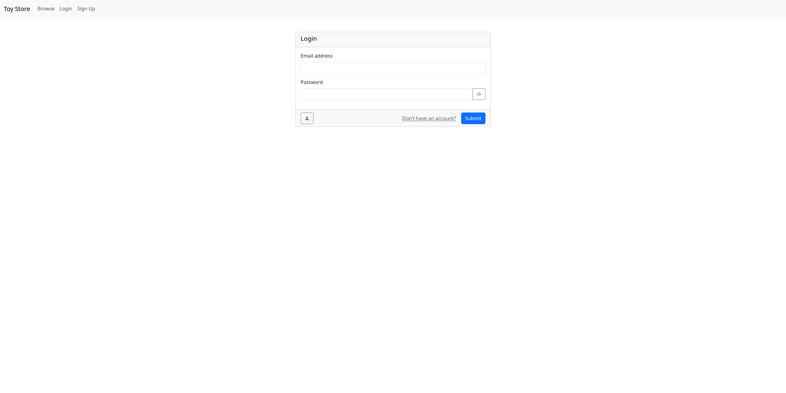

### User Profile
- View and edit profile information
- Manage account settings
- Access order history

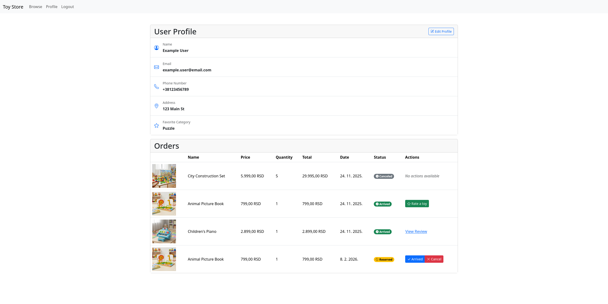

### Reviews & Ratings
- Rate toys after confirming arrival
- Read other customers' reviews
- View detailed review information

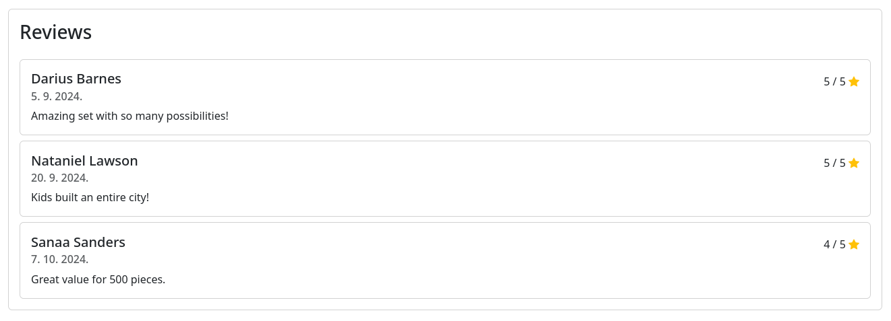

### Order Management
- View order history in a table format
- Cancel pending orders
- Track order status

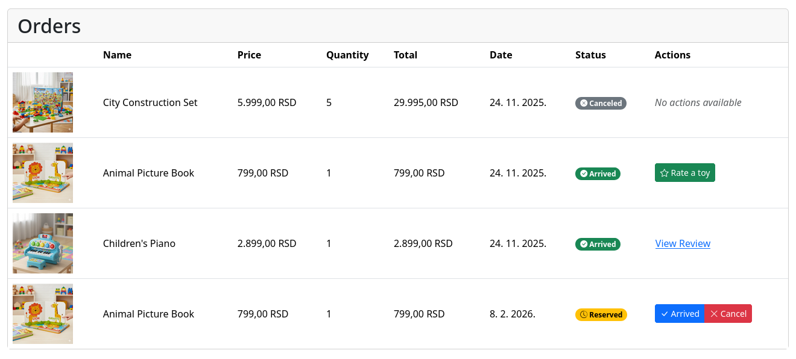

### Interactive Modals
- Reservation confirmation
- Profile editing
- Rating submission
- Order cancellation
- Review details

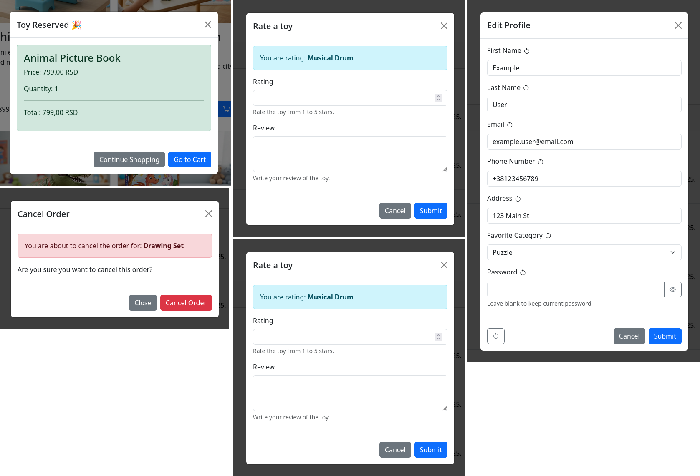


## Getting Started

### Prerequisites

- [Bun](https://bun.sh/) installed on your machine
- [Node.js](https://nodejs.org/) (for compatibility with some tools)

### Installation

1. Clone the repository:
```bash
git clone https://github.com/tomovicj/toy-store-ui-prototype.git
cd toy-store-ui-prototype
```

2. Install dependencies:
```bash
bun install
```

3. Start the development server:
```bash
bun start
```

4. Open your browser and navigate to `http://localhost:4200`

### Build for Production

```bash
bun run build
```

The production build will be stored in the `dist/` directory.


## Project Structure

```
src/
├── app/
│   ├── components/        # Reusable components
│   │   ├── toy-card/      # Product card component
│   │   ├── toy-reviews/   # Reviews display component
│   │   ├── user-profile/  # Profile display component
│   │   ├── order-table/   # Order history table
│   │   ├── navbar/        # Navigation component
│   │   ├── dropdowns/     # Filter and sort dropdowns
│   │   └── modals/        # Modal dialogs
│   ├── pages/             # Page components
│   │   ├── home/          # Home/catalog page
│   │   ├── toy/           # Product detail page
│   │   ├── login/         # Login page
│   │   ├── sign-up/       # Registration page
│   │   ├── profile/       # User profile page
│   │   └── about/         # About page
│   ├── services/          # Data services
│   ├── models/            # TypeScript interfaces
│   ├── guards/            # Route guards
│   └── pipes/             # Custom pipes
├── public/                # Static assets
└── styles.css             # Global styles
```


## Screenshots Gallery

### Mobile Responsive View
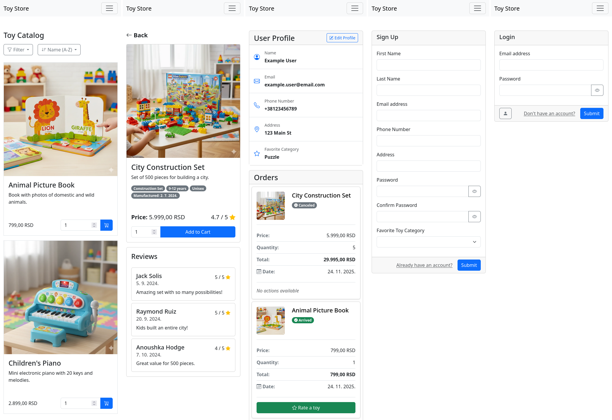

### Filter and Sort dropdowns
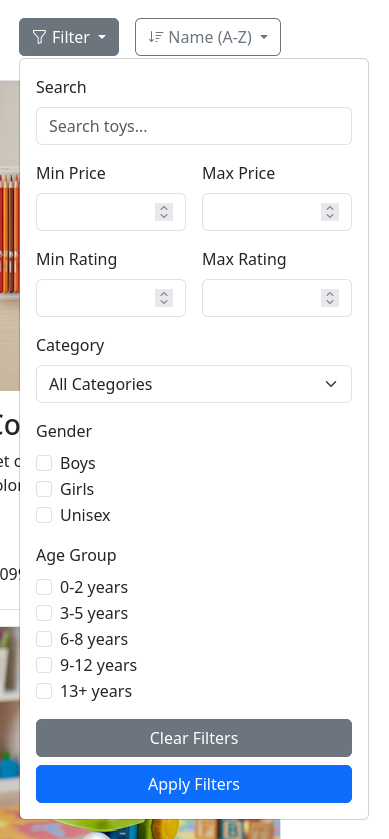

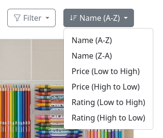


## Future Enhancements

This prototype could be extended with:
- Shopping cart functionality
- Payment processing simulation
- Real-time inventory updates
- Admin dashboard


## License

This project is open source and available under the [MIT License](LICENSE).


## Contact

Created by Jovan Tomovic - feel free to reach out!

- GitHub: [@tomovicj](https://links.jovantomovic.com/github)
- LinkedIn: [Jovan Tomovic](https://links.jovantomovic.com/linkedin)
- Email: contact@jovantomovic.com
